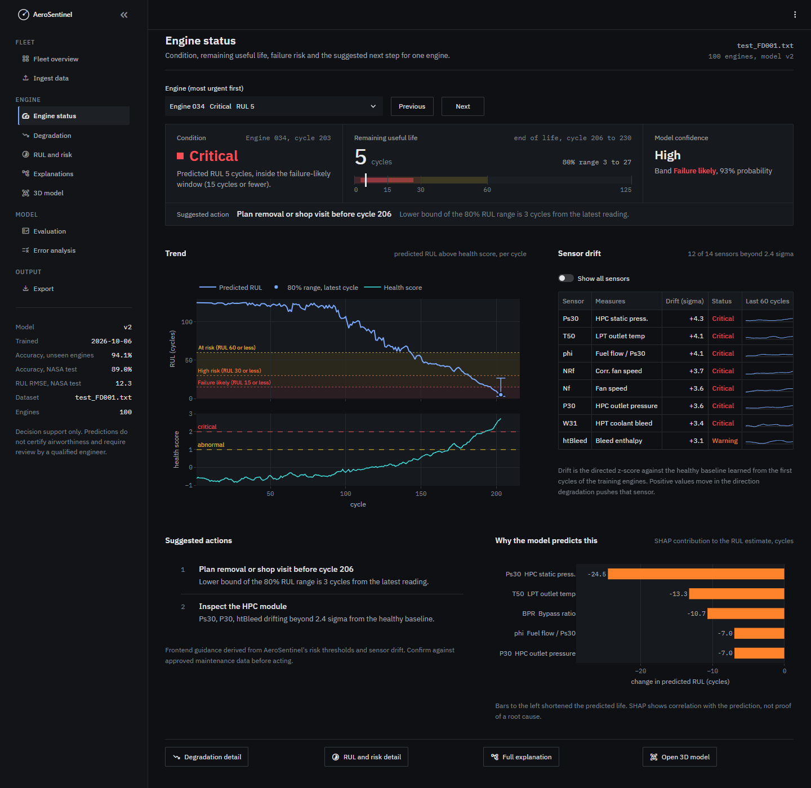
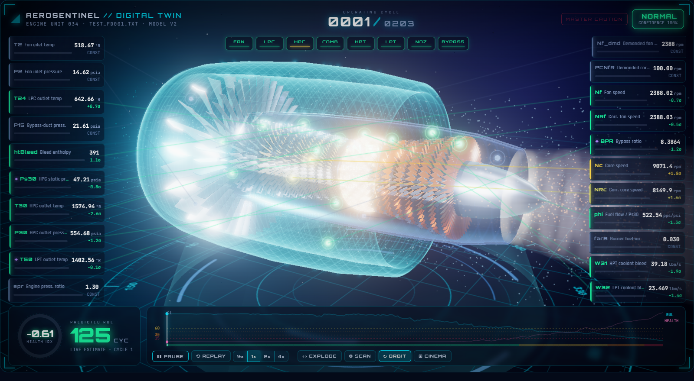
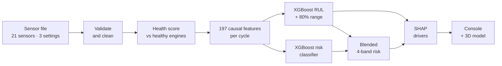

<p align="center">
  
</p>

<p align="center">
  
  
  
  
</p>

<h1 align="center">AeroSentinel</h1>

<p align="center">
  <b>Which engine needs attention next, how many cycles it has left, and which sensors are saying so.</b>
</p>

<p align="center">
  Predictive maintenance for turbofan engines: remaining-useful-life forecasts, four-band failure risk and
  sensor-level explanations, trained on NASA C-MAPSS and delivered through an engineering console with a 3D engine model.
</p>

<p align="center">
  <a href="#quick-start">Quick start</a> ·
  <a href="#inside-the-console">Inside the console</a> ·
  <a href="#how-it-works">How it works</a> ·
  <a href="#results">Results</a> ·
  <a href="#limitations-and-responsible-use">Limitations</a>
</p>

<table align="center">
  <tr>
    <td align="center"><h2>12.3</h2>cycles of RUL error<br/><sub>RMSE · NASA test set</sub></td>
    <td align="center"><h2>0.912</h2>R² for RUL<br/><sub>NASA test set</sub></td>
    <td align="center"><h2>94%</h2>risk bands correct<br/><sub>held-out engines · every cycle</sub></td>
    <td align="center"><h2>89%</h2>risk bands correct<br/><sub>NASA test set · 100 engines</sub></td>
    <td align="center"><h2>2.2 s</h2>to score a fleet<br/><sub>100 engines · SHAP included</sub></td>
  </tr>
</table>

---

## Why it exists

A turbofan rarely fails without warning. As its high-pressure compressor wears, temperatures creep up, spool
speeds shift and fuel flow drifts: a little every cycle, spread across 21 sensor channels. Fixed maintenance
schedules ignore those signals. They pull healthy engines off the wing early and can still miss the one that is
degrading fast, and reading raw telemetry by hand stops working after a handful of engines.

AeroSentinel reads the full recorded history of every engine in a fleet and answers four questions for each one:

| Question | What you get |
|---|---|
| **How long has it got?** | Remaining useful life (RUL) in cycles, an 80% range around it, and the end-of-life window that range implies |
| **How worried should I be?** | One of four risk bands, *Normal*, *At risk*, *High risk* or *Failure likely*, with the model's probability |
| **What is changing?** | A health score measured against healthy engines, and the drift of every sensor, module by module |
| **Why does the model think so?** | The sensors that pushed this prediction up or down, ranked by SHAP |

---

## Inside the console



**Engine status** puts everything about one engine on a single screen: its condition, RUL on a banded scale, the
end-of-life window in cycles, how confident the model is, the trend, which sensors are drifting, suggested next
steps and the SHAP drivers. Step through the fleet with *Previous* and *Next*; the status panel animates from one
engine's values to the next, so you see exactly what changed.



**3D model** places all 21 sensors at their real stations on a sectioned turbofan, from fan inlet to exhaust.
Each module takes the colour of its most-drifted sensor, the hot section warms as turbine outlet temperature drifts,
and *Replay* plays back the engine's recorded life while an event log notes every escalation.
Keys: `Space` replay or pause, `E` exploded view, `H` hide panels, `Esc` reset the camera.

### Five condition states

Every engine is in exactly one state, always shown as a word and never by colour alone.

| State | Meaning |
|---|---|
| **Critical** | Predicted band is *Failure likely*: 15 cycles or fewer left |
| **Warning** | Predicted band is *High risk*: 16 to 30 cycles left |
| **Degrading** | Predicted band is *At risk* (31 to 60 cycles), or the health score is already abnormal |
| **Healthy** | *Normal* band and normal health |
| **Insufficient data** | Fewer than 30 cycles recorded, so trends are not yet reliable. It never hides a Critical or Warning result. |

<details>
<summary><b>Every page in the console</b></summary>
<br/>

| Section | Page | What it is for |
|---|---|---|
| Fleet | **Fleet overview** | Engines ranked by urgency: condition mix, RUL forecast with 80% ranges, attention queue, health-trend heatmap and fleet-wide drivers. Click any engine to open it. |
| Fleet | **Ingest data** | Upload a C-MAPSS-format file, or use the NASA sample, and get a processing report with data warnings. |
| Engine | **Engine status** | The single-engine summary shown above. |
| Engine | **Degradation** | Health score over time, the full sensor-drift table, and any sensor plotted against its healthy baseline. |
| Engine | **RUL and risk** | RUL history across the risk bands, the 80% range, review flags and a filterable fleet table. |
| Engine | **Explanations** | SHAP drivers behind the RUL and the risk prediction. |
| Engine | **3D model** | The sectioned engine shown above, with a deep-dive chart for any sensor you click. |
| Model | **Evaluation** | Verified metrics against baselines, per-band results and confusion matrices. |
| Model | **Error analysis** | Where the model is wrong on NASA's test engines, and by how much. |
| Output | **Export** | Engine results and cycle history as CSV, and the full result as JSON. |

The look is deliberately calm: IBM Plex type, a dark neutral palette with one blue accent, status colours reserved
for status, and motion only when something actually changes. Three.js, GSAP and the fonts ship with the repo, so the
console works offline.
</details>

---

## Quick start

You need Python 3.10 or newer. Trained models ship in `models/v2`, so there is nothing to train before you start.

```bash
git clone https://github.com/Ruc-hi21/AeroSentineL.git
cd AeroSentineL
pip install -r requirements.txt
python -m scripts.download_data              # NASA C-MAPSS FD001 into data/raw/
python -m streamlit run app/streamlit_app.py
```

Open **http://localhost:8501** and press **Load NASA sample fleet**. To try your own data, use *Ingest data* with
any file in the C-MAPSS layout (unit, cycle, 3 settings, 21 sensors).

| Also useful | Command |
|---|---|
| Retrain model v2 from scratch (about 6 minutes, rewrites `reports/`) | `python -m training.train` |
| Rank the NASA test engines by risk in the terminal | `python -m scripts.predict` |
| Run the 52 tests (data, models, pipeline and every console page) | `python -m pytest` |

---

## How it works



1. **Validate and clean.** Checks the 26-column C-MAPSS layout, drops rows that cannot be tied to an engine and
   cycle, and flags readings outside the range seen in training.
2. **Keep the sensors that matter.** Seven of the 21 FD001 sensors are flat for the whole run; the 14 that move are kept.
3. **Score health.** Each sensor is compared with a healthy baseline from the first 30 cycles of the training
   engines. An engine is *abnormal* above the 99th percentile of healthy behaviour and *critical* at twice that.
4. **Engineer features.** 197 features per cycle, all causal, so a cycle only ever sees its own past: rolling means
   and spreads over 5, 15 and 30 cycles, exponentially weighted means, 15/30/50-cycle trend slopes, and drift from
   the engine's own first 15 cycles.
5. **Predict RUL.** An XGBoost regressor learns RUL capped at 125 cycles (early life counts as fully healthy), and
   10th and 90th percentile quantile models give the 80% range.
6. **Classify risk.** The classifier's band probabilities are blended 25/75 with the bands implied by the RUL
   forecast. The 75% weight came from 5-fold cross-validation on training engines only.
7. **Explain.** SHAP ranks the five sensors with the most influence on each RUL and risk prediction.

| Risk band | Predicted RUL |
|---|---|
| **Failure likely** | 15 cycles or fewer |
| **High risk** | 16 to 30 cycles |
| **At risk** | 31 to 60 cycles |
| **Normal** | more than 60 cycles |

---

## Results

Every modelling choice was made with GroupKFold cross-validation on the 100 training engines, so no engine
appears on both sides of a split. NASA's official test set was scored once, at the very end.

| | Model v1 | **Model v2** |
|---|---|---|
| Risk accuracy · 5-fold CV over training engines | 0.889 | **0.943** |
| Risk accuracy · 20 held-out engines, every cycle | 0.883 | **0.941** |
| Risk macro-F1 · held-out engines | 0.798 | **0.880** |
| Risk accuracy · official test set (100 engines, last cycle) | 0.870 | **0.890** |
| RUL RMSE · held-out engines (cycles) | 15.07 | **8.62** |
| RUL RMSE · official test set (cycles) | 17.09 | **12.31** |
| RUL R² · official test set | 0.831 | **0.912** |

**Against simpler models** on the same 20 held-out engines:

| Model | RUL RMSE (cycles) | Risk accuracy |
|---|---|---|
| Linear / logistic regression | 15.5 | 0.930 |
| Random forest | 9.9 | 0.917 |
| XGBoost classifier on its own | n/a | 0.937 |
| **AeroSentinel v2** | **8.6** | **0.941** |

**When it is wrong, it is wrong by a little.** All 11 risk-band misses on the test set land in the neighbouring
band, and 8 of them are within 5 cycles of a band limit. No engine that is truly *High risk* or *Failure likely*
is ever called *Normal*. The 80% RUL range contains the true RUL for 85% of held-out cycles and 77% of test engines.
With one prediction per test engine, test accuracy carries a standard error of about ±3 points.

| Target | Goal | Achieved |
|---|---|---|
| RUL RMSE on test engines | below 18 cycles | **12.3** |
| Risk macro-F1 across the four bands | above 0.85 | **0.88** on held-out engines; **0.83** on the test set, just short |
| Scoring latency | under 25 ms per engine cycle | **about 0.2 ms per cycle**: 13,096 cycles from 100 engines in 2.2 s, SHAP included, on a laptop |

---

## Two interfaces, one model

| Branch | Interface |
|---|---|
| `main` | The engineering console shown above: calm, dense and built for maintenance review. |
| `ui-streamlit` | The earlier cinematic "mission control" interface, with neon styling and a glowing 3D engine. |

Both run the same pipeline and the same trained models. Switch with `git checkout ui-streamlit`, then start
Streamlit as usual.

---

## Under the hood

<details>
<summary><b>Dataset</b></summary>
<br/>

| | |
|---|---|
| **Name** | NASA C-MAPSS FD001, turbofan engine degradation simulation |
| **Source** | [NASA Prognostics Data Repository](https://data.nasa.gov/dataset/C-MAPSS-Aircraft-Engine-Simulator-Data/xaut-bemq) |
| **Training** | 100 engines, each run until failure |
| **Test** | 100 engines stopped before failure, with their true RUL provided |
| **Per cycle** | 21 sensor channels and 3 operational settings |
| **Scenario** | One operating condition (sea level) and one fault mode (HPC degradation) |
</details>

<details>
<summary><b>Repository layout</b></summary>
<br/>

```text
app/                    Streamlit console
  views/                one file per page
  engine3d/             Three.js engine model (custom component)
  instruments/          GSAP engine status panel (custom component)
  insights.py           condition states, confidence, sensor drift, suggested actions
  theme.py              design tokens and shared UI pieces
src/                    the pipeline: data, preprocessing, analysis, features, models, explainability, evaluation
training/train.py       trains and evaluates model v2, writes reports/
scripts/                download_data.py, predict.py
models/v2/              trained models and metadata (v1 kept for comparison)
reports/                metrics.json, test-set predictions, training figures
tests/                  pytest suite
```

`index.html`, `package.json` and `vite.config.js` at the root are an early web prototype and are not used by the
Streamlit console.
</details>

<details>
<summary><b>Tech stack</b></summary>
<br/>

| Layer | Tools |
|---|---|
| Data and ML | Python 3.10+, pandas, NumPy, scikit-learn, XGBoost, SHAP |
| Console | Streamlit, Plotly, Three.js r186, GSAP 3.15, IBM Plex Sans and Mono |
</details>

---

## Limitations and responsible use

- Trained and evaluated on **FD001 only**: one operating condition and one fault mode, not the full C-MAPSS range.
- The data is **simulated**, not telemetry from real aircraft.
- **100 training engines** is a small sample, so overfitting remains a real risk.
- The risk-band limits are a **design choice**, not a validated regulatory standard.
- Suggested actions in the console are rules built on the model's outputs and are labelled as guidance.

> [!CAUTION]
> AeroSentinel is a **decision-support tool**. It is **not** a certified airworthiness determination, must **not**
> be used for real-time in-flight safety decisions, and does **not** replace certified maintenance procedures.
> Predictions inform human review; they never trigger maintenance action on their own.

---

## Team

Built by **Group 88** as an OJT capstone project:

- **Aarohi Ruchita**
- **Prem Singh**

The project is not accepting external contributions at the moment.

## License

Released under the [MIT License](LICENSE). Three.js (MIT), GSAP (standard no-charge license) and IBM Plex
(SIL Open Font License) are bundled under their own licences.
